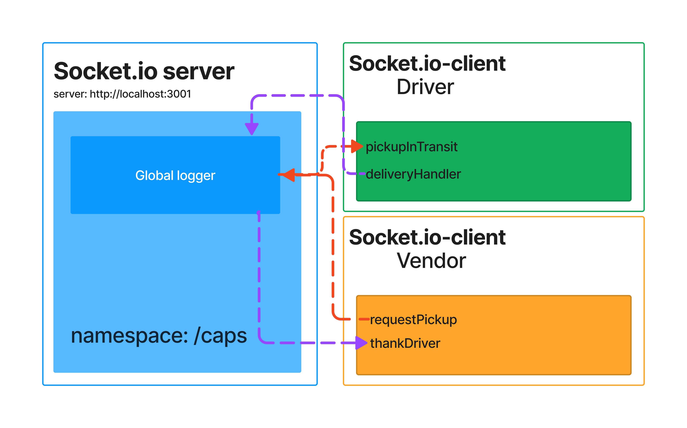

# LAB - Class 11 -- Class 12

## Project: Event Driven Applications

## Author: Kenny W. Lino

## Problem Domain

In this lab, we start implementing an application called "The Code Academy Parcel Service". This system mimics a supply chain by simulating a delivery system that has vendors that can request deliveries and drivers that can deliver them.

Using event-driven programming, we set up events such as the pick-up request from a vendor to trigger a notification for the driver.

In Class-12, we bring in the socket.io module to replace the node.js `events` module and use it to handle the events. We separate the vendor and driver into different folders from the server which allows us to simulate clients triggering (emitting) and acting on events.

### Links and Resources

- [CLASS-12: Socket.io PR](https://github.com/kennywlino/caps/pull/3)
- [CLASS-11: PR with corrections from code review](https://github.com/kennywlino/caps/pull/3)
- [CLASS-11: Original PR from events](https://github.com/kennywlino/caps/pull/1)

### Setup

#### How to initialize/run your application

- CLASS-12 -- `node index.js` in driver, vendor and server directories
- CLASS-11 -- `node hub.js`

### Features / Routes

#### CLASS-12

  The clients and server are separated into different directories.

  - `driver` and `vendor` -- contain handlers and index
  - `server` -- contain index

#### CLASS-11

- `eventPool.js` -- sets up the eventPool from the `events` module
- `hub.js` -- main file that triggers the first action of PICKUP and handles the event pool
- `pickUpHandler.js` -- handler for picking up orders
- `inTransitHandler.js` -- handler for indicating in transit orders
- `deliveredHandler.js` -- handler for indicating delivered orders

### Tests

- How do you run tests?
  - `npm test`

- Any tests of note?

  <handler>.test.js -- each file tests whether the payload has `console.log()` and emits the right event

#### UML

